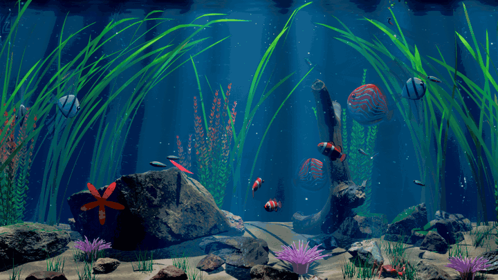

<div align="center">

# Aquarium

**A photoreal, living aquarium that runs as your macOS wallpaper. Real time, written in Rust with Bevy.**

[](#license)
[](https://www.rust-lang.org)
[](https://bevyengine.org)
[](#requirements)
[](https://github.com/akaloic/aquarium/actions/workflows/build.yml)



### [▶ Watch it and see how it works: akaloic.github.io/aquarium](https://akaloic.github.io/aquarium/)

</div>

Volumetric water crossed by shafts of light, caustics dancing on scanned rocks, plants
swaying in the current, twenty fish schooling, and a quiet life on the bottom: a red-claw
crab that walks sideways on real inverse kinematics and runs to hide under a rock overhang
when you come close, flatfish that bury themselves in the sand, starfish creeping on the
glass.

Move your mouse and the fish scatter. Click and food rains down. Leave it alone and it
drifts into slow motion. Cover it with windows and it stops drawing entirely.

It is also an exercise in measuring instead of guessing. Every performance or energy claim
below comes from a measurement on real hardware, and each animal's behaviour is checked
against **81 physics criteria** at three frame cadences.

## Highlights

- **Looks real.** Poly Haven photogrammetry scans with procedural moss. A custom
  volumetric water shader with light shafts. Animated caustics projected by the lamp with
  soft (PCSS) shadows. Fresnel glass with lens-like curved corners, TAA and ACES tone mapping.
- **Alive.** Boids whose steering is smoothed until no frame shows a jerk. A crab whose
  eight legs plant, lift and step with IK. Hideouts found automatically under overhangs.
  Everything reacts to your cursor, and a click drops food.
- **At home on your desktop.** `--wallpaper` puts it below your icons, on every Space,
  click-through, on your MacBook's own screen, following screen changes. It needs no
  permissions.
- **Frugal by design.** Asleep at 9 fps in slow motion when nobody is looking. Paused
  when covered, locked or the display sleeps. On battery it runs at 30 fps at the same
  definition, with the GPU at **2.1 W**.
- **Never "refreshes" in front of you.** The render resolution is picked by a measurement
  behind the start-up curtain and only changes while nobody is watching.
- **Tested like a physics engine.** A recorder logs every animal every frame, and a script
  checks 81 criteria: never inside a rock, no foot slipping, no teleports, calm again within 3 s.

## Measured on an Apple M4 MacBook Air (fanless)

| | |
|---|---|
| Frame time, full resolution 2940×1846 | **≈ 22 ms** (36 ms in 4K); dynamic resolution holds 60 fps |
| GPU power, wallpaper asleep (9 fps) | **0.76 W** (desktop alone: 0.25–0.5 W) |
| GPU power, awake on battery (30 fps) | **2.1 W** |
| GPU power, awake full screen at 60 fps | 12.5 W, like a 3D game, which is why it only wakes up for 30 s at a time |
| Memory (whole app, CPU + GPU) | ≈ 1.0 GB |
| Start-up | ≈ 4 s behind a black curtain (shaders compiled, quality measured), then a fade-in |
| Physics bench | 81 / 81 checks at 1/60 s, 1/30 s and irregular frame times |

Power comes from the chip's energy counters (IOReport, no admin rights needed). The method
and the full cost breakdown are on the [project page](https://akaloic.github.io/aquarium/).

## Quick start

### Requirements

- macOS on Apple Silicon (developed and measured on an M4; the wallpaper mode is macOS only)
- [Rust](https://rustup.rs) stable (edition 2024)
- ~61 MB of CC0 assets, downloaded once by a script

### Run

```bash
git clone https://github.com/akaloic/aquarium.git
cd aquarium
./scripts/fetch_assets.sh     # once: rocks, driftwood, shell, sand (Poly Haven, CC0)
cargo run --release           # full screen; Esc quits
```

The first launch compresses the textures for the GPU (≈ 1 s) and caches them in
`~/Library/Caches/aquarium`. After that everything runs offline.

### Make it your wallpaper

```bash
cargo build --release
nohup ./target/release/aquarium --wallpaper >/dev/null 2>&1 &   # start
pkill -x aquarium                                               # stop
```

With [`just`](https://github.com/casey/just): `just wallpaper`, `just stop-wallpaper`,
`just install-login` (starts it at every login through a user LaunchAgent) and
`just uninstall-login`.

The executable looks for `assets/` next to itself, then in the current directory, then at
the repository root (`AQUARIUM_ASSETS=/path` forces it).

## Controls

| Input | Effect |
|---|---|
| move the mouse | the cursor becomes a finger dipped in the water: nearby fish dart away (the panic spreads through the school, then calms down in 2–3 s), particles swirl in its wake, the crab runs for cover, flatfish lift off the sand |
| left click | a pinch of flakes: rings on the surface (and in the caustics on the floor), flakes floating then fluttering down; the fish rush in, what reaches the floor is for the crab |
| mouse wheel | back off to see the whole tank, or push in until you "dive" |
| right / middle drag | orbit the tank (damped, bounded), then it drifts back |
| F3 | overlay: FPS, frame time, visible meshes, ray samples, quality level, resolution, power mode |
| Esc | quit |

In wallpaper mode the window ignores clicks, so your desktop keeps working. The mouse
crossing the desktop, or **⌃⌥⌘A**, wakes the aquarium up.

### Options

```
--wallpaper            live wallpaper (below the desktop icons)
--no-sleep             wallpaper always fully awake
--low-power            30 fps, half the particles
--windowed             1600x1000 window instead of full screen
--dof                  depth of field (focus follows the cursor)
--quality low|medium|high
--view <v>             fixed camera: fill | front | hero | side | top | low | close | inside
--screenshot out.png   offscreen render (no window): capture after --frames frames, then quit
--frames N             default 90
```

## How it works

The [project page](https://akaloic.github.io/aquarium/) has animated, interactive versions of
these explanations.

### Rendering

| Part | Technique |
|---|---|
| Water volume | Bevy's volumetric fog shader replaced (`volumetric_water.wgsl`). The volumetric light is located once per pixel, ~10 cm steps adapt to the length of water crossed and are jittered every frame for TAA to integrate, with soft shadows of plants and rocks and multiple-scattering ambient in the shade |
| Light shafts | each ray-march sample is modulated by the surface pattern where the light ray crosses the water: thin shafts, sharp under the surface, blurring with depth, aligned with the caustics on the floor |
| Caustics | a full-screen pass of the render graph (no extra camera) renders the pattern into a texture that the lamp projects as a light cookie, so everything receives moving caustics with real soft shadows. The food's ripples draw rings of light in them |
| Glass | flat panes: Fresnel reflection of the room blended over the scene (as accurate as transmission for a thin pane, 7 ms cheaper); curved corners use real screen-space transmission (water lenses) |
| Surface | micro-ripples and impact rings from above; total internal reflection and Snell's window from below |
| Rocks | Poly Haven scans simplified with meshoptimizer to 0.2 mm, under a pixel at wallpaper framing (448k → 285k triangles). Normal maps carry the fine relief, and the moss is procedural |
| Textures | compressed for the GPU on first launch (BC7 colour and data, BC5 normals, BC4 height) then read from a disk cache: 4× less GPU memory, no CPU copy kept |
| Plants | procedural vallisneria, stem plants, hairgrass and anemones, swaying in the vertex shader. They are laid out after the rocks are known, and any plant that would touch a stone (at rest or swaying) slides to the nearest free spot |
| Colour | ACES tone mapping, per-tone grading, bloom, contrast-adaptive sharpening |
| Start-up | a black curtain while shaders compile (every material, including pooled ones, is drawn from the first frames) and the quality is measured, then a fade-in: no hitch at the first bubble or flake |

**Where the GPU time goes.** Measured by switching each effect off in turn on the same
frame (Bevy's GPU timers return 0 on Metal, so ablation it is), with baseline runs
interleaved because the Mac heats up:

| Part | ms per frame (of ≈ 23) |
|---|---|
| volumetric water | **8.0**: 0.6 pass, 2.5 per-pixel set-up, then per step: shadows 2.6, density 1.0, shafts 0.8 |
| lamp shadows outside the water | 1.1 (same with a 1024, 2048 or 4096 map) |
| plants | ≈ 2 (each species < 0.8) |
| reflections and sky | 1.6 |
| TAA / bloom / sharpening | 1.3 / 0.9 / 0.2 |
| glass, surface, rocks, fish, particles, cabinet | ≤ 0.5 each |

The water shader used to find where each ray leaves the box by testing its six faces
against each other (36 dot products and branches per pixel). A classic ray-box slab test
does the same job in 0.7 ms less, and hoisting what doesn't change along the ray saves
another 0.3 ms. The image is unchanged (54.5 dB against 50.8 dB between two identical
renders).

### A resolution change you never see

Changing the render resolution resets the temporal filters (a burst of grain in the water)
and makes the sharpness jump. Done while someone watches, it looks like the screen
"refreshing". So:

- **At start-up, behind the black curtain**, one uncapped run at full resolution measures
  what a frame costs on this Mac. It scales the scene's reference cost model
  (`5 ms + 3.6 ms per megapixel` on an M4), and the sharpest level that fits 80 % of a
  60 Hz frame is chosen before the first image appears. Only frames slower than the
  refresh can be timed: macOS holds faster ones back, with or without vsync, and they read
  ~16.7 ms whatever they cost. A covered window reads faster than it renders (16.4 ms
  instead of 24), so the measurement waits until the window is visible.
- **While running**, the GPU load macOS reports is useless as a cost: under vsync the GPU
  lowers its clock to fill the frame and sits near 80 % at any level that fits (79 % at 50 %
  resolution, 78 % at 67 %). Only frames missing the refresh for 4 s with the GPU saturated
  count. A better level is applied only while nobody is looking (wallpaper asleep, window
  hidden).
- **If frames keep missing the refresh**, it takes the smallest step that ends it, once. If
  macOS was reporting heat, the previous level comes back after 5 cool minutes.
- **On battery or in Low Power Mode**, 30 fps at the budget of 60: the saved time is saved
  energy (2.1 W instead of 8.7 W when that time went into pixels).

On an M4 this lands at 67 % in a window and 58 % in full screen. Five cold launches measured
20.1 / 20.1 / 21.2 / 21.6 / 22.0 ms and picked the same level every time.

### Energy

| Situation | Rendering | Simulation |
|---|---|---|
| window covered (full-screen app, other windows), screen locked, display asleep | none (full pause) | stopped |
| on mains, awake | 60 fps (vsync) | real time |
| battery, Low Power Mode, critical heat or `--low-power`, awake | 30 fps, same definition as at 60 | real time |
| wallpaper asleep | 9 fps | slow motion ×0.2 |
| asleep, battery < 30 % | one frame every 2 s | slow motion ×0.05 |

While paused, the event loop only wakes up every 2 s to check the screen: cameras off,
simulation clock stopped. The thermal state (`NSProcessInfo.thermalState`) is read every
2 s and tightens the frame budget *before* macOS throttles the GPU. On a fanless MacBook
Air the same frame went from 25 to 41 ms once hot.

### The decor's distance field

`src/sdf.rs` bakes a signed distance field of all the static decor on a 1 cm grid
(145×70×65). The glass, surface and sand are analytic and available at once. The scanned
rocks, driftwood and pebbles follow in a background task: 340k triangles, the same ones the
GPU draws, baked in ≈ 0.2 s with exact point-triangle distances in a narrow band, then
propagated and signed by a flood fill from the open water. The triangles are freed
afterwards.

Fish avoidance, sinking food, the bottom dwellers walking on sand and rocks, the cursor
(sphere tracing) and the hideout search all use a trilinear lookup plus gradient into it.
No ray casts against approximations. The same field checks that no rock sinks into
another (`AQ_OVERLAPS=1`).

### The inhabitants

| Species | Count | Behaviour |
|---|---|---|
| Neon tetra | 12 | tight school, iridescent blue line, red tail |
| Angelfish | 3 | slow, long fins, pelvic filaments |
| Clownfish | 3 | stay near the anemones |
| Discus | 2 | orange disc with turquoise lines, very calm |
| Red-claw crab | 1 | walks sideways on the sand and gentle slopes. IK legs: feet stay planted, alternating steps whose rhythm follows the speed. Picks with its claws, eats what falls, hides under an overhang when you come close |
| Flatfish | 2 | camouflaged in the sand, short hops, bury themselves in a puff of sand, take off if disturbed |
| Starfish | 2 | a few mm/s, one on the front glass (you see its tube feet), one on a rock; lifts its arms if touched |

- **Fish**: procedural meshes. The body-tail wave is in the vertex shader (frequency and
  amplitude follow speed, the body curves in turns), and the swim state is packed in a
  `MeshTag` so instancing is kept.
- **Boids**: separation, alignment and cohesion blended smoothly, Perlin wander, and
  steering with bounded angular acceleration. Before this, 60 simulated seconds of
  20 fish showed ~42 000 abrupt changes of angular velocity; after, 4 minor ones.
- **Avoidance**: follows the gradient of the distance field, slowing down progressively.
  The fish curves around an obstacle, choosing a side once and keeping it.
- **Bottom dwellers**: they walk on the field (projected onto its zero iso-surface at each
  step, smoothed normal), decide at 4 Hz and move at the display rate. Legs, antennae, fins
  and arms are animated on the GPU (`critter_anim.wgsl`), with the same animation in the
  prepass (shadows, motion vectors).

### Physics test bench

A recorder logs every animal every frame for 2 to 5 simulated minutes, with a scripted
cursor, clicks and a general scare every 20 s. `scripts/physics_report.py` then checks
81 criteria, among them:
- never inside the decor, confinement, speeds, accelerations;
- teleports beyond what top speed allows in a frame;
- rotation jerks in calm swimming (as angular acceleration), calm again after a scare (≤ 3 s);
- the crab's ground contact, every foot (no slipping, legs within reach), and its carapace,
  eyes, knees and claws out of the rocks;
- reactions and hideouts, flatfish flat and buried, starfish stuck to their surface,
  sinking flakes, rising bubbles.

It runs at three cadences, because a real window doesn't always hold 60 fps: a fixed
1/60 s step, 1/30 s, and `vsync` (a third of the frames miss a refresh, plus a 100 ms hitch
every ~5 s).

```bash
just physics                     # 1/60 s
AQ_PHYSICS_DT=30 just physics    # 1/30 s; AQ_PHYSICS_DT=vsync for irregular frames
```

The bench found real bugs, all fixed:
- the crab's carapace went up to 12 mm into a rock while walking along it;
- its knees crossed its hideout's ceiling half the time it was inside;
- its raised claws dug into stone;
- crab and flatfish popped 2.5 cm onto a pebble in one frame;
- the fish pitch limit broke at 30 fps.

### Engineering notes (and what was deliberately not done)

- **GPU boids / spatial grid**: rejected. With 20 fish the whole simulation (neighbours,
  distance field, avoidance, cursor, food) costs ≈ 50 µs per frame on the CPU, against
  ~20 ms of rendering. A compute shader would add latency and synchronisation for nothing.
- **Occlusion culling**: rejected. The tank is almost entirely visible; a hierarchical depth
  pass would cost more than it saves. Bevy's frustum culling is on.
- **Stronger rock simplification**: rejected. A 0.8 mm tolerance would leave 52k
  triangles but only save 1 ms, with a visible difference on the relief. 0.2 mm cannot be
  told apart at 100 % side by side.
- **Better BC7 preset**: "very fast" gains 1.6 dB over "ultra fast" (49.8 vs 48.2 dB) for
  17× the encoding time. The difference is invisible, so "ultra fast" stays. BC1 (half the
  size) was rejected: 41 dB, blocks show.
- **Single-threaded sleep**: rejected after measuring 22.6 → 19.5 % of a core at best. The
  render schedules can't run single-threaded (the Metal surface must touch the NSView on
  the main thread).
- **Frame interpolation**: the simulation costs ~0.1 ms, and rendering each frame is what
  costs. The real saving is rendering fewer frames, which is what the sleeping aquarium does.
- **No allocations in the loop**: bubbles, flakes and sand grains come from preallocated
  pools. Audio and gamepads are disabled, because an open audio stream keeps the audio
  hardware awake for nothing.

## Development

```
src/main.rs            app, window, plugins (no audio, no gamepads)
src/config.rs          command-line options
src/camera.rs          framing, orbit, zoom and dive, render target (direct or offscreen)
src/quality.rs         invisible dynamic resolution (start-up calibration, cost model, heat)
src/power.rs           energy: pause, battery, sleeping aquarium, wake-up
src/wallpaper.rs       wallpaper mode (desktop window level via AppKit, screen following)
src/macos.rs           IOKit, Foundation, CoreGraphics and Carbon bindings
src/textures.rs        JPEG → mips → BC7/BC5/BC4 → disk cache, no CPU copy
src/sdf.rs             the decor's signed distance field
src/interaction.rs     cursor finger, food, ripples, wakes, focus
src/intro.rs           start-up curtain and fade
src/environment.rs     lamp, fill light, environment
src/tank.rs            glass, floor, cabinet
src/water/             water volume, surface, caustics, particles
src/scape/             sand, rocks and moss, procedural plants, scans (read + simplify)
src/fish/              species, meshes, boids, bubbles
src/benthos/           crab (IK), flatfish, starfish
src/physics_probe.rs   physics bench recorder (AQ_PHYSICS)
src/debug.rs           F3 overlay, frame limiter, capture, autopilot
assets/shaders/        WGSL
scripts/               asset download, physics report
examples/texbench.rs   speed and PSNR of the BC encoders on the real textures
```

Debug variables:

| Area | Variables |
|---|---|
| Rendering and captures | `AQ_RES=WxH`, `AQ_CAM=ex,ey,ez,cx,cy,cz,fov`, `AQ_CAM_FOLLOW=crab\|flatfish\|starfish`, `AQ_SEQ=from,count,every` (image sequences), `AQ_OFFSCREEN=1` |
| Profiling by ablation | `AQ_DISABLE=taa,bloom,fog,env,dof,cas,pcss,shadows`, `AQ_HIDE=name,…` |
| Quality and energy | `AQ_LEVEL=n` (fixed quality level), `AQ_BATTERY=1` (behave as on battery), `AQ_POWER_TEST=sleep\|still`, `AQ_NO_OCCLUSION=1`, `AQ_CPU=1` (CPU time and frame pacing), `AQ_MEM=1` |
| Physics and traces | `AQ_PHYSICS=dir`, `AQ_PHYSICS_DT=30\|vsync`, `AQ_AUTOPILOT=1` (scripted cursor and clicks), `AQ_FISH_TRACE=f.csv` (fixed time step) |
| Decor | `AQ_OVERLAPS=1` (pieces and plants inside rocks), `AQ_SDF_SLICE=prefix`, `AQ_SDF_PROBE=x,z` |
| Assets | `AQ_TEX_RAW=1` (uncompressed textures), `AQ_NO_SIMPLIFY=1`, `AQ_SCAN_ERROR=mm` |

## Limitations

Honest ones:
- The wallpaper mode is macOS only, on the MacBook's own screen (external displays keep
  their wallpaper). It has been developed and measured on one machine, an M4 MacBook Air.
  Windowed mode should run wherever Bevy runs, but that is untested.
- Awake at 60 fps it uses the GPU like a game. That is why it sleeps whenever it can.
- There is no menu-bar icon yet: stop it with `pkill -x aquarium` or `just stop-wallpaper`.
- macOS computes the menu bar's text colour, Mission Control thumbnails and the lock
  screen from your real wallpaper, not from the aquarium. Pick a dark one.
- The scene is an artistic mix of freshwater (neons, angelfish, discus) and marine life
  (clownfish, anemones, starfish).

## License

Code: [MIT](LICENSE-MIT) or [Apache-2.0](LICENSE-APACHE), at your option.

Assets: rocks, driftwood, shell and sand textures from [Poly Haven](https://polyhaven.com),
[CC0](https://creativecommons.org/publicdomain/zero/1.0/). They are downloaded by
`scripts/fetch_assets.sh` and not stored in this repository. Fish, crab, plants, water and
everything else are procedural.
